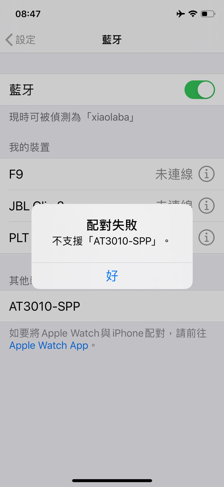

### Bluetooth function is not working, why ?

app and user manual had no instruction,   

Android APK, no google store, manufacturer provide the APK for download, but BLUETOOTH connection is not ok. why ?  

Apple store APP E_test, [https://apps.apple.com/tw/app/e-test/id1478623332](https://apps.apple.com/tw/app/e-test/id1478623332)  

BLUETOOTH connection failed, it is asking the manufacturer to advise resolution.  
  

