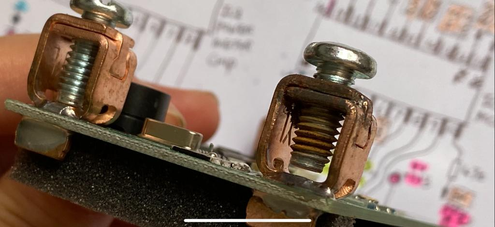
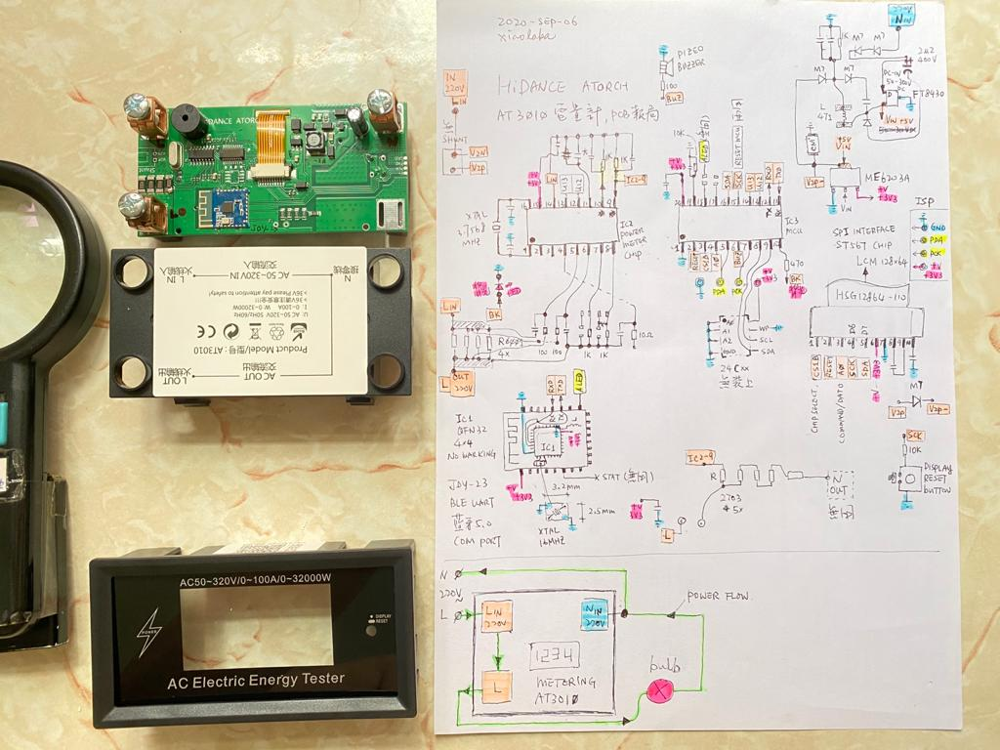

# AT3010, JDY-23 bluetooth UART module

reverse engineering the bluetooth UART module JDY-23 of AT3010 used, the blue color module.  
all those information, datasheet and or related stuff, gathered from internet, used google search engine, no any affiliation to any of those company.

Note: DO NOT uses for 220VAC & 100A and constantly metering, it has not enough of safety. 13A is so so and should be ok. This new buying unit out of a purchased batch has defect as the connector has been corroded possibly due to soldering flux residue and no cleaning, screw corroded & jammed, brute force kicks it off. Upon this fix and opened the case, try to see the circuit design, it should be one of typical power metering solution that booms few years ago. However, IC marking has been ripped off as possible to slow down conterfeit if it was really great product design and hot selling.

my schematic and fun to learn something new, copyright is retianed as my own learning material, it is nothing related to manufacturer. This schematic is incomplete but enough to understand the prespective of circuit design and operation thoery, for example. 4 pieces of R0001 paralleled, it should be the current senseing resitor for metering.  
  
.  
.  

    
  

### JDY-23 datesgeet and app note  
[JDY-23_Ultra_Low_Energy_Bluetooth_5.0_BLE_Module.pdf](JDY-23_Ultra_Low_Energy_Bluetooth_5.0_BLE_Module.pdf)  
[JDY-23_Notes_xara.pdf](JDY-23_Notes_xara.pdf)  
[possible the IC solution BK3213S_datasheet.pdf](BK3213S_datasheet.pdf)  
[possible the IC solution BK3231S_FCC_report_4492592.pdf](BK3231S_FCC_report_4492592.pdf)  
.  
.  
.  
### old module JDY-18,  
  
.  
  
.  
  
.  
  

seraching tlsr8263 datasheet, 
https://www.google.com/search?safe=strict&client=firefox-b-d&ei=o-JSX-HUKJvrwQPeqJSgCA&q=tlsr8263+datasheet&oq=TLSR8263+dat&gs_lcp=CgZwc3ktYWIQARgAMgUIIRCgAToCCABQ0mtYq4UBYOKXAWgAcAB4AIABlwGIAecHkgEDOS4zmAEAoAEBqgEHZ3dzLXdpesABAQ&sclient=psy-ab

summary about BLE 5.0 and chip supply in the market.  
https://blog.csdn.net/weixin_42583147/article/details/80923946  
https://blog.csdn.net/cornrn/article/details/100033122  
http://news.eeworld.com.cn/mp/BLE5CODER/a39122.jspx  
local printed copy  
  
-电子头条-EEWORLD电子工程世界.pdf)  

SDK of MS1973 https://github.com/macrogiga  
SDK for MS179x BLE chip (QFN32, Cortex-M0) 16Mhz, https://github.com/xiaolaba/MS1793-SDK  
oh... ARM chip for BLE

