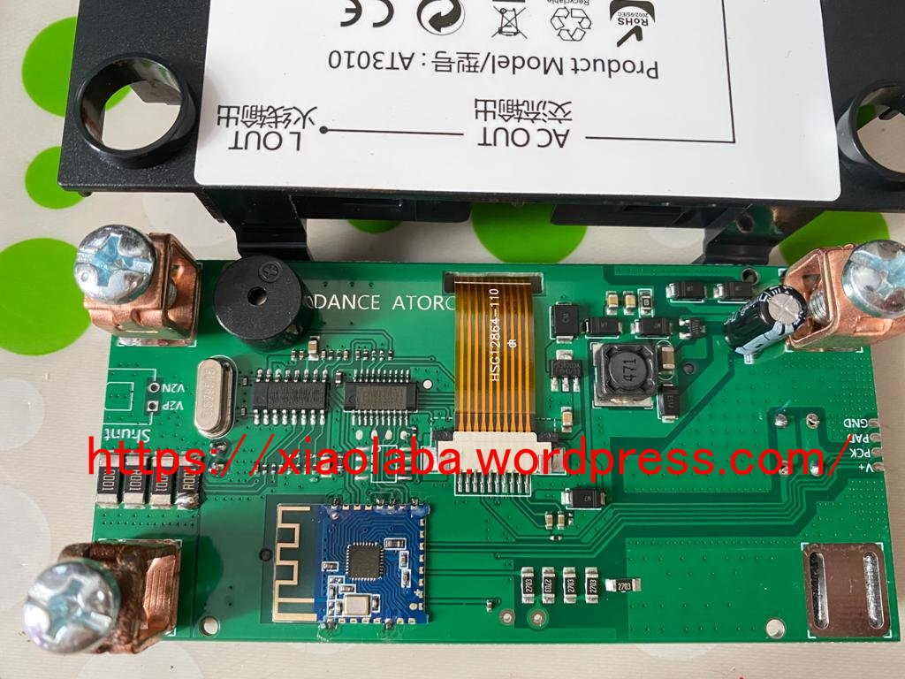
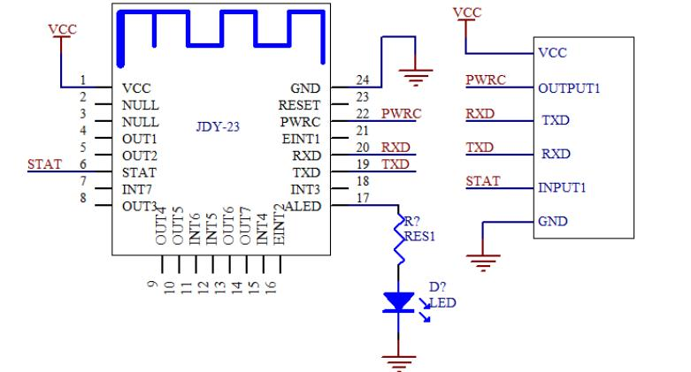
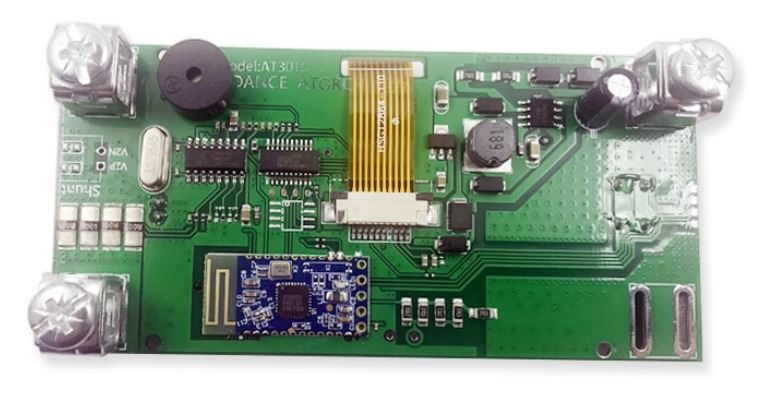
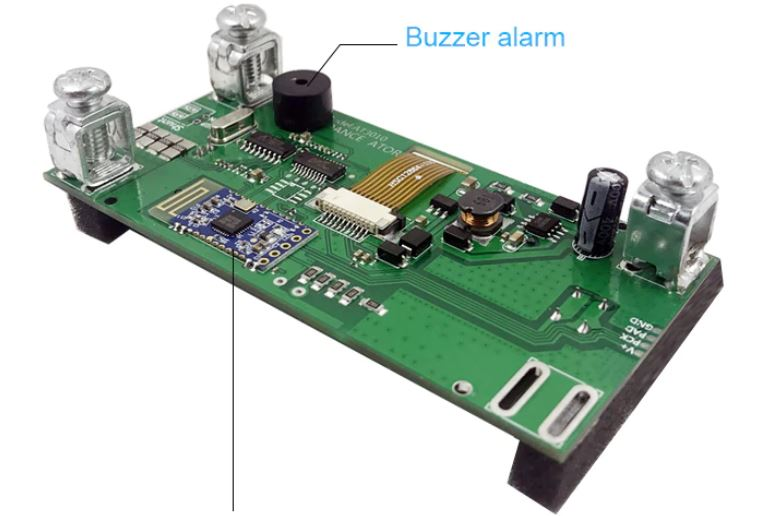
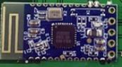

# AT3010, JDY-23 bluetooth UART module
reverse engineering the bluetooth UART module JDY-23 of AT3010 used.  

    

[JDY-23 Ultra Low Energy Bluetooth 5.0 BLE Module.pdf](JDY-23 Ultra Low Energy Bluetooth 5.0 BLE Module.pdf)
[JDY-23_Notes_xara.pdf](JDY-23_Notes_xara.pdf)  

  

  

  

