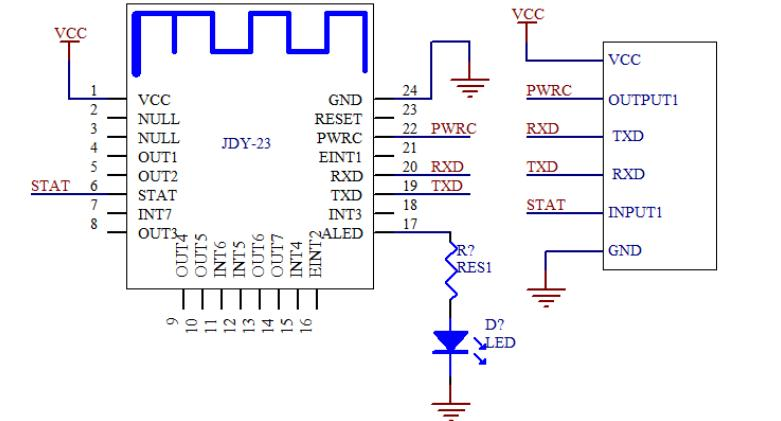
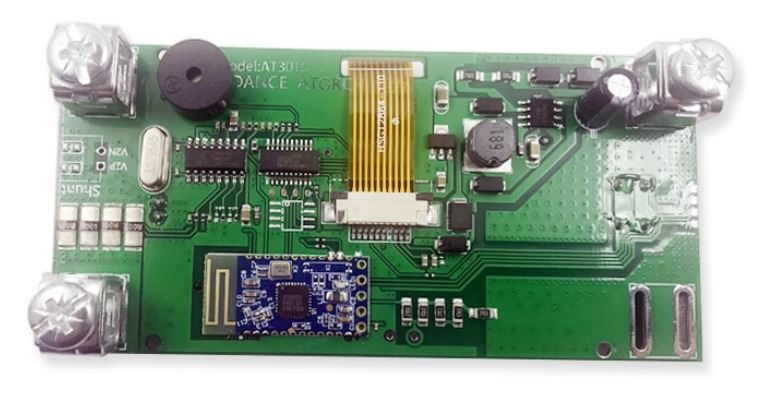
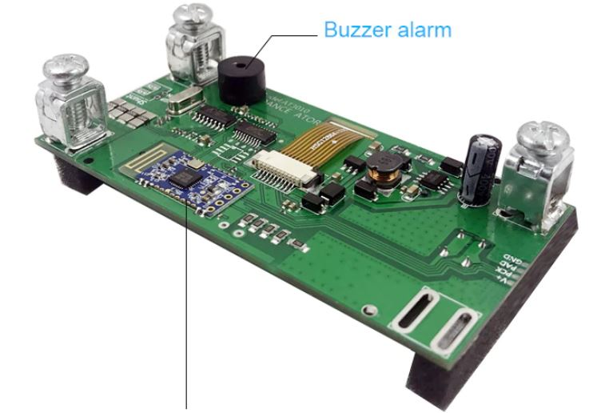
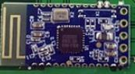

# AT3010, JDY-23 bluetooth UART module
reverse engineering the bluetooth UART module JDY-23 of AT3010 used.  

    
  

### JDY023 datesgeet and app note  
[JDY-23_Ultra_Low_Energy_Bluetooth_5.0_BLE_Module.pdf](JDY-23_Ultra_Low_Energy_Bluetooth_5.0_BLE_Module.pdf)  
[JDY-23_Notes_xara.pdf](JDY-23_Notes_xara.pdf)  

### old module
  

  

  

