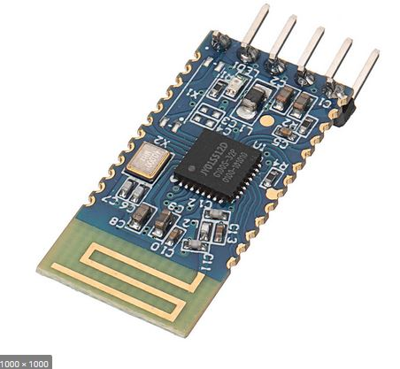

# AT3010, JDY-23 bluetooth UART module
reverse engineering the bluetooth UART module JDY-23 of AT3010 used, the blue color module.  
all those information, datasheet and or related stuff, gathered from internet, used google search engine, no any affiliation to any of those company.

    
  

### JDY-23 datesgeet and app note  
[JDY-23_Ultra_Low_Energy_Bluetooth_5.0_BLE_Module.pdf](JDY-23_Ultra_Low_Energy_Bluetooth_5.0_BLE_Module.pdf)  
[JDY-23_Notes_xara.pdf](JDY-23_Notes_xara.pdf)  
[possible the IC solution BK3213S_datasheet.pdf](BK3213S_datasheet.pdf)  
[possible the IC solution BK3231S_FCC_report_4492592.pdf](BK3231S_FCC_report_4492592.pdf)  
.  
.  
.  
### old module JDY-18,  
  
.  
  
.  
  
.  
  

